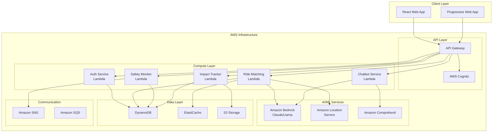

# Design Document - CollegeChale

## Overview

CollegeChale is an AI-powered, campus-verified carpooling platform built on AWS infrastructure to address mobility challenges for Indian college students. The system leverages serverless architecture with AWS Lambda, intelligent AI services through Amazon Bedrock, and real-time location services to create a trusted, safe, and environmentally conscious transportation community.

The platform follows a microservices architecture pattern with clear separation between authentication, ride matching, safety monitoring, and impact tracking services. Each service is designed to scale independently while maintaining data consistency through event-driven communication patterns.

## Architecture

### High-Level Architecture



### Service Architecture Patterns

**Event-Driven Architecture**: Services communicate through Amazon SQS and SNS for loose coupling and scalability.

**CQRS Pattern**: Separate read and write operations for optimal performance, using DynamoDB for writes and ElastiCache for reads.

**Circuit Breaker Pattern**: Implement resilience for external service calls, especially AI services that may have variable response times.

## Components and Interfaces

### Authentication Service

**Purpose**: Manages user registration, campus verification, and session management.

**Key Interfaces**:
```typescript
interface AuthService {
  registerUser(email: string, password: string, collegeInfo: CollegeInfo): Promise<RegistrationResult>
  verifyCollegeEmail(email: string): Promise<VerificationStatus>
  authenticateUser(credentials: LoginCredentials): Promise<AuthToken>
  refreshToken(token: string): Promise<AuthToken>
  getUserProfile(userId: string): Promise<UserProfile>
}

interface CollegeInfo {
  collegeName: string
  emailDomain: string
  studentId?: string
  department?: string
}
```

**AWS Integration**: 
- AWS Cognito for user pool management and JWT token generation
- Custom Lambda triggers for college email domain validation
- DynamoDB for storing extended user profiles and verification status

### Ride Matching Engine

**Purpose**: Core AI-powered service that matches users based on routes, schedules, and preferences.

**Key Interfaces**:
```typescript
interface RideMatchingService {
  createRideRequest(request: RideRequest): Promise<RideRequestId>
  findMatches(requestId: RideRequestId): Promise<RideMatch[]>
  optimizeRoute(participants: UserId[], destination: Location): Promise<OptimizedRoute>
  confirmRide(matchId: MatchId, participants: UserId[]): Promise<ConfirmedRide>
  updateMatchPreferences(userId: UserId, preferences: MatchPreferences): Promise<void>
}

interface RideRequest {
  userId: UserId
  origin: Location
  destination: Location
  departureTime: DateTime
  flexibility: TimeFlexibility
  preferences: MatchPreferences
}

interface MatchPreferences {
  genderPreference?: 'any' | 'same' | 'mixed'
  maxDetour: number // in meters
  trustScoreMinimum: number
  smokingPreference: 'no-smoking' | 'smoking-ok'
}
```

**AI Integration**:
- Amazon Location Service for route calculation and optimization
- Custom ML model on SageMaker for preference-based matching
- Amazon Bedrock for natural language processing of user preferences

### Safety Monitoring Service

**Purpose**: Provides real-time tracking, emergency response, and trust management.

**Key Interfaces**:
```typescript
interface SafetyService {
  startRideTracking(rideId: RideId): Promise<TrackingSession>
  updateLocation(sessionId: SessionId, location: Location): Promise<void>
  triggerSOS(userId: UserId, location: Location): Promise<EmergencyResponse>
  submitRating(rideId: RideId, rating: UserRating): Promise<void>
  calculateTrustScore(userId: UserId): Promise<TrustScore>
  getEmergencyContacts(userId: UserId): Promise<EmergencyContact[]>
}

interface UserRating {
  raterId: UserId
  ratedUserId: UserId
  safetyRating: number // 1-5
  punctualityRating: number // 1-5
  friendlinessRating: number // 1-5
  comments?: string
}
```

**AWS Integration**:
- Amazon Location Service for real-time tracking
- Amazon SNS for emergency notifications
- DynamoDB Streams for real-time trust score updates

### Impact Tracking Service

**Purpose**: Calculates and displays environmental and financial impact metrics.

**Key Interfaces**:
```typescript
interface ImpactService {
  calculateRideImpact(ride: CompletedRide): Promise<RideImpact>
  getUserImpactSummary(userId: UserId, period: TimePeriod): Promise<ImpactSummary>
  getCommunityImpact(collegeId: CollegeId): Promise<CommunityImpact>
  updateGamificationPoints(userId: UserId, impact: RideImpact): Promise<void>
}

interface RideImpact {
  co2Saved: number // in kg
  costSaved: number // in INR
  distanceShared: number // in km
  fuelSaved: number // in liters
}
```

### Chatbot Assistant Service

**Purpose**: AI-powered conversational interface for user assistance and ride booking.

**Key Interfaces**:
```typescript
interface ChatbotService {
  processMessage(userId: UserId, message: string, language: Language): Promise<ChatResponse>
  initiateRideBooking(userId: UserId, intent: BookingIntent): Promise<BookingSession>
  getContextualHelp(userId: UserId, context: UserContext): Promise<HelpResponse>
  translateMessage(message: string, targetLanguage: Language): Promise<string>
}

interface ChatResponse {
  message: string
  language: Language
  actions?: ChatAction[]
  followUpQuestions?: string[]
}
```

**AWS Integration**:
- Amazon Bedrock with Claude for conversational AI
- Amazon Comprehend for sentiment analysis and language detection
- Custom prompt engineering for Indian context and regional languages

## Data Models

### User Data Model

```typescript
interface User {
  userId: string // Primary Key
  email: string // Unique, college email
  profile: UserProfile
  verification: VerificationStatus
  preferences: UserPreferences
  trustScore: number
  createdAt: DateTime
  lastActive: DateTime
}

interface UserProfile {
  firstName: string
  lastName: string
  phoneNumber: string
  college: CollegeInfo
  profilePicture?: string
  emergencyContacts: EmergencyContact[]
}

interface VerificationStatus {
  emailVerified: boolean
  phoneVerified: boolean
  collegeVerified: boolean
  documentVerified: boolean
  verificationDate?: DateTime
}
```

### Ride Data Model

```typescript
interface Ride {
  rideId: string // Primary Key
  status: RideStatus
  participants: RideParticipant[]
  route: RouteDetails
  schedule: RideSchedule
  safety: SafetyInfo
  impact: RideImpact
  createdAt: DateTime
  completedAt?: DateTime
}

interface RideParticipant {
  userId: string
  role: 'driver' | 'passenger'
  pickupLocation: Location
  dropoffLocation: Location
  status: ParticipantStatus
}

interface RouteDetails {
  optimizedRoute: Location[]
  totalDistance: number
  estimatedDuration: number
  estimatedCost: number
  fuelCost: number
}
```

### Location Data Model

```typescript
interface Location {
  latitude: number
  longitude: number
  address: string
  landmark?: string
  placeId?: string // Google Places ID for consistency
}

interface CollegeLocation extends Location {
  collegeId: string
  campusName: string
  gates: CampusGate[]
}

interface CampusGate {
  gateName: string
  location: Location
  operatingHours: TimeRange
}
```

### Trust and Safety Data Model

```typescript
interface TrustProfile {
  userId: string // Primary Key
  trustScore: number // 0-100
  ratingHistory: UserRating[]
  reportHistory: SafetyReport[]
  verificationBadges: VerificationBadge[]
  lastUpdated: DateTime
}

interface SafetyReport {
  reportId: string
  reporterId: string
  reportedUserId: string
  rideId: string
  reportType: ReportType
  description: string
  status: ReportStatus
  createdAt: DateTime
}
```

## Correctness Properties

*A property is a characteristic or behavior that should hold true across all valid executions of a system—essentially, a formal statement about what the system should do. Properties serve as the bridge between human-readable specifications and machine-verifiable correctness guarantees.*

Before defining the correctness properties, let me analyze the acceptance criteria to determine which ones are testable as properties, examples, or edge cases.

### Property 1: Email Domain Validation
*For any* email address, the Campus_Verifier should accept it if and only if it belongs to a recognized Indian educational institution domain
**Validates: Requirements 1.1, 1.4**

### Property 2: Account Activation Round Trip
*For any* valid verification token, clicking the verification link should activate the account and grant platform access
**Validates: Requirements 1.3**

### Property 3: Ride Search Completeness
*For any* valid pickup and destination locations, the system should return all compatible riders within the specified search criteria
**Validates: Requirements 2.1**

### Property 4: Route Optimization Efficiency
*For any* group of ride participants, the suggested pickup sequence and meeting points should minimize the total travel distance and time for all participants
**Validates: Requirements 2.3, 7.2, 7.4**

### Property 5: Ride Confirmation Information Completeness
*For any* confirmed ride, the displayed details should include all required information: co-passenger profiles, pickup time, route, and estimated cost
**Validates: Requirements 2.4**

### Property 6: Continuous Search and Notification
*For any* unmatched ride request, the system should continue searching and notify the user when compatible riders become available
**Validates: Requirements 2.6**

### Property 7: Preference Matching Consistency
*For any* ride match returned by the system, all participants' safety preferences (gender, trust score) should be satisfied
**Validates: Requirements 2.7**

### Property 8: Chatbot Language Consistency
*For any* user message in a supported language, the chatbot response should be in the same language as the input
**Validates: Requirements 3.3**

### Property 9: Ride Booking Guidance Completeness
*For any* ride booking request through the chatbot, the system should provide complete step-by-step guidance
**Validates: Requirements 3.4**

### Property 10: SOS Emergency Response
*For any* SOS activation, the system should immediately alert all designated emergency contacts and platform administrators
**Validates: Requirements 4.2**

### Property 11: Trust Score Access Control
*For any* user whose trust score falls below the threshold, the system should restrict their platform access appropriately
**Validates: Requirements 4.4**

### Property 12: Impact Calculation Completeness
*For any* completed shared ride, the calculated impact should include both CO₂ emissions saved and financial savings (fuel, parking, maintenance)
**Validates: Requirements 5.1, 5.2**

### Property 13: Community Impact Aggregation
*For any* college community, the displayed community metrics should equal the sum of all individual user impacts within that community
**Validates: Requirements 5.3**

### Property 14: Notification Delivery Consistency
*For any* ride event (match found, confirmation, reminder, emergency), appropriate notifications should be sent to all relevant participants
**Validates: Requirements 2.5, 6.1, 6.2, 6.3, 6.4**

### Property 15: Data Synchronization Consistency
*For any* user data change on one device, the same data should be updated across all other devices for that user
**Validates: Requirements 8.3**

### Property 16: Offline Data Persistence
*For any* data cached while offline, it should be synchronized with the server when connectivity is restored
**Validates: Requirements 8.4**

### Property 17: Data Deletion Completeness
*For any* user data deletion request, all personal information should be permanently removed from the system within the specified timeframe
**Validates: Requirements 9.4**

## Error Handling

### Authentication Errors
- **Invalid College Email**: Return specific error codes for different validation failures (invalid domain, non-educational institution, blacklisted domain)
- **Verification Timeout**: Handle expired verification links gracefully with option to resend
- **Rate Limiting**: Implement exponential backoff for repeated failed authentication attempts

### Ride Matching Errors
- **No Matches Found**: Provide alternative suggestions (different times, nearby locations, public transport options)
- **Location Service Failures**: Fallback to cached route data and notify users of potential inaccuracies
- **AI Service Timeouts**: Implement circuit breaker pattern with simplified matching algorithms as fallback

### Safety System Errors
- **GPS Signal Loss**: Continue with last known location and alert participants
- **Emergency Service Failures**: Maintain local emergency contact database as backup
- **False SOS Triggers**: Implement confirmation dialog with 10-second countdown

### Data Consistency Errors
- **Sync Conflicts**: Implement last-write-wins with conflict resolution UI for critical data
- **Cache Invalidation**: Automatic cache refresh on data inconsistency detection
- **Network Partitions**: Queue operations locally and replay when connectivity restored

## Testing Strategy

### Dual Testing Approach

The testing strategy employs both unit testing and property-based testing to ensure comprehensive coverage:

**Unit Tests**: Focus on specific examples, edge cases, and integration points between components. Unit tests validate concrete scenarios and error conditions that are difficult to generate randomly.

**Property Tests**: Verify universal properties across all inputs through randomized testing. Property tests ensure correctness across the vast input space that unit tests cannot cover exhaustively.

### Property-Based Testing Configuration

**Framework**: Use `fast-check` for TypeScript/JavaScript property-based testing with minimum 100 iterations per property test.

**Test Tagging**: Each property test must reference its design document property using the format:
```javascript
// Feature: college-chale, Property 1: Email Domain Validation
```

**Key Property Test Areas**:
- Email validation with random valid/invalid domains
- Route optimization with random participant locations
- Impact calculations with various ride configurations
- Notification delivery across different event types
- Data synchronization across multiple device states

### Unit Testing Focus Areas

**Authentication Flow**: Test specific college email domains, verification token formats, and session management edge cases.

**AI Integration**: Test chatbot responses for specific Indian context queries, language switching scenarios, and escalation triggers.

**Safety Features**: Test SOS activation flows, emergency contact notification sequences, and trust score calculation edge cases.

**Performance Edge Cases**: Test behavior under high load, network failures, and service degradation scenarios.

### Integration Testing

**End-to-End Scenarios**: Test complete user journeys from registration through ride completion, focusing on cross-service communication and data consistency.

**AWS Service Integration**: Validate proper integration with Cognito, Bedrock, Location Service, and SNS using AWS SDK mocks and test environments.

**Multi-Language Support**: Test complete flows in Hindi and regional languages to ensure proper localization throughout the system.

### Load and Performance Testing

**Scalability Validation**: Test auto-scaling behavior under simulated load using AWS Load Testing solution.

**Latency Requirements**: Validate 2-second response time requirement under various load conditions.

**Concurrent User Handling**: Test system behavior with up to 10,000 concurrent users using distributed load testing.